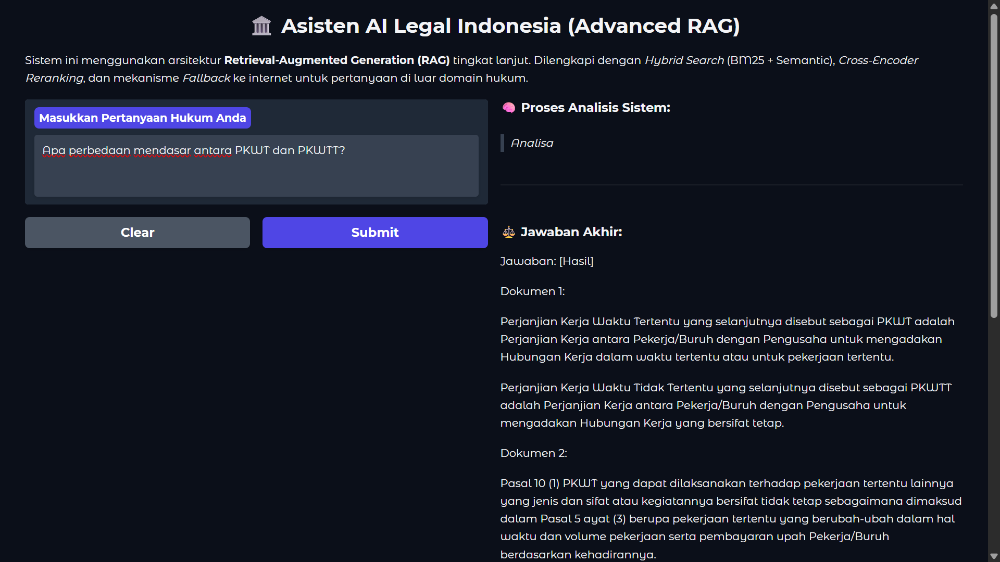

# ⚖️ LexiTune-RAG-Advanced: Indonesian Legal AI Assistant


An advanced, end-to-end Generative AI pipeline designed to act as a professional Indonesian Legal Assistant. This project leverages a Small Language Model (SLM) architecture, specifically **Llama-3.1-8B**, enhanced through **Supervised Fine-Tuning (SFT)**, **Generative Reward Policy Optimization (GRPO)** for logical reasoning, and a highly sophisticated **Advanced Retrieval-Augmented Generation (RAG)** system.

---

## 🚀 Interactive Interface Preview

The system is wrapped in a user-friendly Gradio interface, separating the AI's internal logical reasoning process (`<think>`) from the final formal legal response, complete with source citations.



---

## 📦 Models & Datasets Repository

All fine-tuned models and vector database documents have been open-sourced and can be accessed via the following platforms:

### 🧠 Fine-Tuned Models (Hugging Face)
| Model Type | Description | Link |
| :--- | :--- | :--- |
| **SFT Baseline** | Experiment 1: Standard learning rate and linear scheduler. | [](https://huggingface.co/latief18/legal-llama-3.1-sft-baseline) |
| **SFT Optimized** | Experiment 2: Optimized learning rate with cosine scheduler. | [](https://huggingface.co/latief18/legal-llama-3.1-sft-optimized) |
| **GRPO Reasoning** | Final Model: RL-optimized for deep legal reasoning (`<think>`). | [](https://huggingface.co/latief18/legal-llama-3.1-grpo-reasoning-merged) |

### 📚 Knowledge Base (Kaggle)
| Dataset | Description | Link |
| :--- | :--- | :--- |
| **Legal Documents** | Indonesian Laws and Government Regulations (UU & PP) in PDF format used for the RAG Vector Database. | [](https://www.kaggle.com/datasets/latief18/dokumen-uud-rag-pgabl) |

---

## 🏗️ System Architecture & Key Features

This project is divided into three major engineering phases, ensuring high accuracy and minimizing AI hallucinations in the critical legal domain.

### 1. Supervised Fine-Tuning (SFT)
*   **QLoRA Optimization:** Fine-tuning the Llama-3.1-8B model using 4-bit quantization via **Unsloth**, significantly reducing VRAM usage while maintaining 16-bit performance.
*   **Instruction Tuning:** Trained on the `alpaca-gpt4-indonesian` dataset mapped to ChatML format to adapt the model's linguistic capabilities to formal Indonesian.
*   **Comparative Experiments:** Conducted multiple training runs (Baseline vs. Optimized) to find the best hyperparameter combination (Cosine Scheduler, lower LR) preventing overfitting.

### 2. Generative Reward Policy Optimization (GRPO)
*   **Reasoning Induction:** Implemented Reinforcement Learning to force the model to "think" before answering. The model generates a `<think>...</think>` block to analyze legal contexts logically.
*   **Custom Reward Shaping:** 
    *   *Format Reward:* Enforces strict adherence to the `<think>` XML tags.
    *   *Correctness Reward:* Cross-Encoder similarity checks against ground truth.
    *   *Length Reward:* Penalizes overly short, impulsive answers.
    *   *Language Penalty:* Prevents English hallucinations.

### 3. Advanced RAG Pipeline
*   **Parent-Child Chunking:** Splits documents into small chunks (400 chars) for precise vector search, but retrieves the larger parent chunk (3000 chars) to preserve legal context for the LLM.
*   **Ensemble Retriever (Hybrid Search):** Combines **BM25** (Lexical/Keyword search) with **ChromaDB** (Semantic/Vector search using `BAAI/bge-m3`) to ensure exact legal terms (e.g., "Pasal 15") are not missed.
*   **Hypothetical Document Embeddings (HyDE):** Uses the LLM to generate a hypothetical answer to the user's query, which is then vectorized to find the most semantically similar real documents.
*   **Cross-Encoder Reranking:** Re-evaluates the retrieved documents using `BAAI/bge-reranker-base` to extract the absolute Top-3 most relevant contexts.
*   **Dynamic Internet Fallback:** Implements a strict logit threshold. If the local legal database yields a relevance score below the threshold, the system automatically falls back to real-time internet search via **DuckDuckGo API**.

---

## 📂 Repository Structure

```text
.
├── docs/
│   └── gradio_ui_deployment.png       # UI Screenshots and documentation assets
├── notebooks/
│   ├── 01_SFT_FineTuning.ipynb        # Phase 1: QLoRA Fine-Tuning & EDA
│   ├── 02_GRPO_Reasoning.ipynb        # Phase 2: Reinforcement Learning & Reward Functions
│   └── 03_Advanced_RAG_System.ipynb   # Phase 3: Vector DB, Hybrid Search, Reranker & UI
├── .env.example                       # Template for required API Keys (HF_TOKEN, etc.)
├── .gitignore                         # Git ignore configurations
├── LICENSE                            # Project License
├── README.md                          # Project Documentation
└── requirements.txt                   # Consolidated Python dependencies
```

---

## ⚙️ Installation & Usage

To replicate or run the notebooks locally or on cloud environments (Kaggle/Colab):

1. **Clone the repository:**
   ```bash
   git clone https://github.com/LatiefDataVisionary/legalbot-rag-pipeline.git
   cd legalbot-rag-pipeline
   ```

2. **Install dependencies:**
   ```bash
   pip install -r requirements.txt
   ```

3. **Environment Variables:**
   Rename `.env.example` to `.env` and insert your Hugging Face token (Write Access required for pushing models).
   ```env
   HF_TOKEN=your_huggingface_token_here
   WANDB_API_KEY=your_wandb_api_key_here
   ```

4. **Execution Order:**
   * Run `01_SFT_FineTuning.ipynb` to generate the base instruct model.
   * Run `02_GRPO_Reasoning.ipynb` to inject reasoning capabilities.
   * Run `03_Advanced_RAG_System.ipynb` to build the ChromaDB index and launch the Gradio interface. *(Note: You can skip directly to Notebook 03 by utilizing the pre-trained models linked above).*
